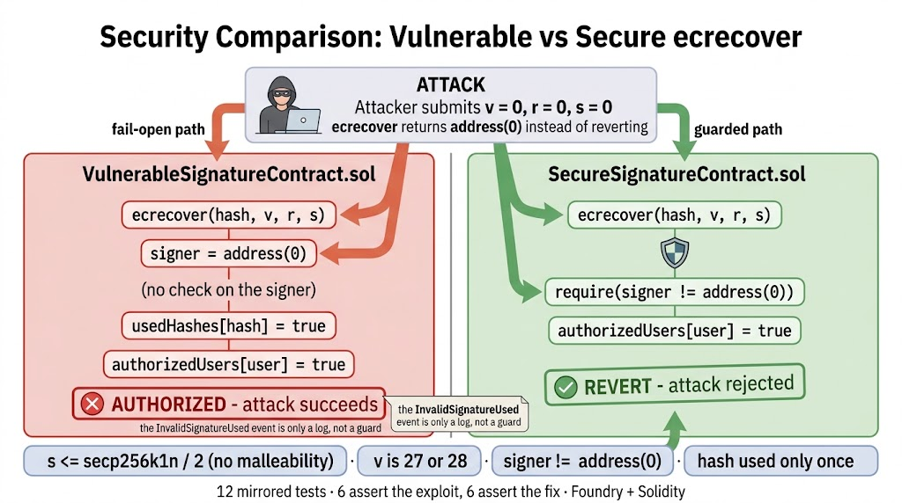

<div align="center">
  <h1>🛡️ Off-chain Signatures — Vulnerable vs Secure ecrecover</h1>
  <p><b>The same signature-based authorization implemented twice — once with the classic ecrecover mistakes and once hardened — with an attack suite that proves both sides</b></p>
</div>

## 📖 About the Project

**Off-chain Signatures** is a security-focused Smart Contract reference built with **Solidity** `^0.8.13` and thoroughly tested using the **Foundry** framework. It implements the same authorization primitive twice: `VulnerableSignatureContract` recovers a signer with `ecrecover` and trusts the result, while `SecureSignatureContract` applies the validation that `ecrecover` itself does not perform. The two contracts sit side by side so the difference is visible in the diff, not in prose.

The repository is built around proof rather than description. Two mirrored test suites run the **same six scenarios** against both contracts: the suite against the vulnerable version asserts that the attacks *succeed*, and the suite against the hardened version asserts that the very same inputs are *rejected*. That pairing is what makes the failure mode concrete — a reader can see exactly which check stops which attack, and what happens to a real deployment when that check is missing.

**Key Technical Findings:**
* **`ecrecover` returns `address(0)` on invalid input — it never reverts.** Any code that uses the result without a `signer != address(0)` check fails open. This is the single vulnerability the project is built to demonstrate.
* **Signature malleability:** `(r, s)` and `(r, -s mod n)` both recover a valid signer, so a signature can be re-encoded into a second valid one. The hardened path rejects any `s` above `secp256k1n / 2`.
* **`v` validation:** only `27` and `28` are accepted, which rejects malformed headers and non-canonical encodings.
* **Replay protection:** every hash is recorded in `usedHashes` and can only be consumed once, so a valid signature cannot be replayed inside the same contract.
* **Foundry Framework:** 12 tests across 2 mirrored suites — 6 asserting the exploit works, 6 asserting the fix holds.

---

## ⚙️ How It Works

Both contracts expose the same five-function surface: `authorizeUser` (verify a signature and authorize an account), `authorizeUserWithECDSA` (the same, taking a packed 65-byte signature), `recoverSigner` (raw recovery), `createAuthorizationHash` (build the message to sign) and `processData` (an action that requires authorization). The difference is entirely in what happens between `ecrecover` and the state write.

The vulnerable path calls `ecrecover(hash, v, r, s)` and moves on. Because the opcode returns the zero address instead of reverting when the signature is invalid, `v = 0, r = 0, s = 0` produces `signer = address(0)` and the function continues: it marks the hash as used, sets `authorizedUsers[user] = true` and only then emits an informational `InvalidSignatureUsed` event. The authorization has already happened by the time anyone could notice, and the event is a log entry, not a guard.

The hardened path adds four checks, each marked with an `@audit` comment in the source. It parses the 65-byte signature with assembly (`mload` at offsets 32, 64 and 96), rejects `s` values in the upper half of the curve order to eliminate malleability, accepts only `v = 27` or `v = 28`, requires the recovered signer to be non-zero, and consumes the hash exactly once. The minimal `authorizeUser` version applies the same non-zero check on the `ecrecover` result without the assembly parsing, which is the smallest change that closes the fail-open behaviour.

One boundary is worth stating explicitly, because a reference implementation invites copy-paste: neither contract compares the recovered signer against anything else. The check is *"the signature is well-formed"*, not *"the right account signed"*, and the hash is supplied by the caller rather than derived from the user and a contract-specific domain. As written, any valid signature authorizes any account, and the same signature is accepted by a second deployment of the contract. Both behaviours are reproducible with the pattern below; binding the signer to the authorized account and adding an EIP-712 domain separator are the two additions a production integration needs on top of this code.

### Architecture Diagram



### Core Component File Paths

[VulnerableSignatureContract.sol](./src/VulnerableSignatureContract.sol) - The fail-open implementation: `ecrecover` result used without validation

[SecureSignatureContract.sol](./src/SecureSignatureContract.sol) - The hardened implementation: signer, malleability, `v` and replay checks

[SignatureAttacks.t.sol](./test/SignatureAttacks.t.sol) - Six attacks asserted to succeed against the vulnerable contract

[SecureSignatureAttacks.t.sol](./test/SecureSignatureAttacks.t.sol) - The same six scenarios asserted to be rejected by the secure contract

## 💻 Technical Docs

The instructive pair is the two `authorizeUser` implementations — identical except for the validation block — followed by the fully hardened `authorizeUserWithECDSA`.

### authorizeUser (vulnerable)
File: src/VulnerableSignatureContract.sol

```Solidity
    function authorizeUser(uint8 v, bytes32 r, bytes32 s, bytes32 hash, address user) external {
        // VULNERABILITY: Missing validation of ecrecover result
        address signer = ecrecover(hash, v, r, s);

        // This check is missing: require(signer != address(0), "Invalid signature");

        // Check if hash has been used before
        require(!usedHashes[hash], "Hash already used");

        // Mark hash as used
        usedHashes[hash] = true;

        // Authorize the user
        authorizedUsers[user] = true;

        emit UserAuthorized(user, hash);

        // If signer is address(0), this indicates an invalid signature
        if (signer == address(0)) {
            emit InvalidSignatureUsed(signer, hash);
        }
    }
```

### authorizeUser (secure)
File: src/SecureSignatureContract.sol

```Solidity
    function authorizeUser(uint8 v, bytes32 r, bytes32 s, bytes32 hash, address user) external {
        // SECURE: Proper validation of ecrecover result
        address signer = ecrecover(hash, v, r, s);

        // CRITICAL FIX: Check that ecrecover returned a valid address
        require(signer != address(0), "Invalid signature");

        // Check if hash has been used before
        require(!usedHashes[hash], "Hash already used");

        // Mark hash as used
        usedHashes[hash] = true;

        // Authorize the user
        authorizedUsers[user] = true;

        emit UserAuthorized(user, hash);
    }
```

### authorizeUserWithECDSA
File: src/SecureSignatureContract.sol

```Solidity
    function authorizeUserWithECDSA(bytes memory signature, bytes32 hash, address user) external {
        // This would use OpenZeppelin's ECDSA.recover() which automatically
        // reverts on invalid signatures
        // address signer = ECDSA.recover(hash, signature);

        // For demonstration, we'll use ecrecover with proper validation
        require(signature.length == 65, "Invalid signature length");

        bytes32 r; // 32 bytes
        bytes32 s; // 32 bytes
        uint8 v; //2 byte

        assembly {
            r := mload(add(signature, 32))
            s := mload(add(signature, 64))
            v := byte(0, mload(add(signature, 96)))
        }

        // Handle malleability
        if (uint256(s) > 0x7FFFFFFFFFFFFFFFFFFFFFFFFFFFFFFF5D576E7357A4501DDFE92F46681B20A0) {
            // @audit SIGNATURE MALLEABILITY PROTECTION
            revert("Invalid signature 's' value");
        }

        if (v != 27 && v != 28) {
            // v must be either 27 or 28 for legacy Ethereum signatures.
            revert("Invalid signature 'v' value"); // Some off-chain signing tools may use 0/1 instead, which would need conversion, but this code assumes canonical Ethereum values.
        }

        address signer = ecrecover(hash, v, r, s);
        require(signer != address(0), "Invalid signature"); // @audit SIGNATURE VALIDATION PROTECTION

        // Check if hash has been used before
        require(!usedHashes[hash], "Hash already used"); // @audit REPLAY ATTACK PROTECTION

        // Mark hash as used
        usedHashes[hash] = true;

        // Authorize the user
        authorizedUsers[user] = true;

        emit UserAuthorized(user, hash);
    }
```

## 🚀 Execution Example

Here is a step-by-step example of the attacks the suites run, with the values they actually use.

- Step 1: Setup
Each suite deploys one contract and defines three accounts: `alice = address(0x1)`, `bob = address(0x2)` and `attacker = address(0x3)`. The signatures are produced with `vm.sign(privateKey, hash)`, which is the same ECDSA operation a wallet performs off-chain.

- Step 2: The valid path
`testValidSignature` builds a hash with `createAuthorizationHash(bob, 1)`, signs it and calls `authorizeUser(v, r, s, hash, bob)`. Bob ends up authorized and `isAuthorized(bob)` returns true. Both contracts agree on this case — the fixes must not break legitimate use.

- Step 3: The exploit — a completely invalid signature
`testVulnerabilityWithInvalidSignature` calls `authorizeUser` with `v = 0`, `r = bytes32(0)` and `s = bytes32(0)`. `ecrecover` returns `address(0)` and the vulnerable contract **authorizes the attacker anyway**. The same call against the secure contract reverts with `"Invalid signature"` in `testRejectsInvalidSignature`. This is the fail-open behaviour in one test.

- Step 4: The exploit — a malformed signature
`testVulnerabilityWithMalformedSignature` uses `v = 255`, `r = 1`, `s = 1` and gets the same result: the attacker is authorized by the vulnerable contract and rejected by the secure one. It shows the flaw is not about one specific set of zero values but about trusting the opcode's output in general.

- Step 5: Raw recovery
`recoverSigner(0, bytes32(0), bytes32(0), hash)` returns `address(0)` on the vulnerable contract, which the test asserts directly — the raw evidence that invalid input does not revert. The secure `recoverSigner` reverts instead, and `testRecoverSignerRejectsInvalidSignature` asserts that.

- Step 6: Replay
`testReplayAttack` authorizes Bob once, then submits the identical `(v, r, s, hash)` again. Both contracts reject the second call with `"Hash already used"`, because the per-hash record is shared by the two implementations. This is the one protection the vulnerable contract does have.

- Step 7: Authorization gating
`testProcessDataRequiresAuthorization` calls `processData` before being authorized and expects `"Not authorized"`, then authorizes itself and checks the call succeeds. It is the practical consequence of the whole exercise: signature checks exist to gate exactly this kind of action.

## ⬆️ Installation

The only dependency is `forge-std`, wired as a git submodule.

```Bash
git clone --recursive https://github.com/k2gutierrez/off-chain-signatures.git
cd offchainsignatures
forge build
```

## 🧪 Testing

Two mirrored suites, 12 tests in total, running entirely in-process — no fork or RPC endpoint is required.

```Bash
forge test -vvv
```

- `test/SignatureAttacks.t.sol` — six tests against `VulnerableSignatureContract`. Three of them (`testVulnerabilityWithInvalidSignature`, `testVulnerabilityWithMalformedSignature`, `testRecoverSignerWithInvalidSignature`) assert that the exploit succeeds; the rest cover the valid path, replay protection and authorization gating.
- `test/SecureSignatureAttacks.t.sol` — the same six scenarios against `SecureSignatureContract`, where the invalid and malformed signatures now revert.

## 📊 Coverage

```Bash
forge coverage
```
